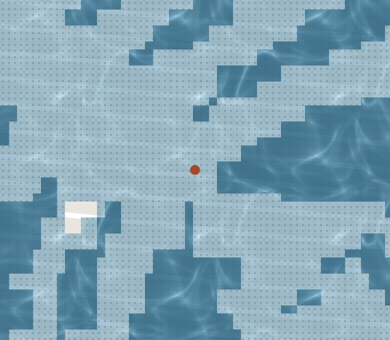
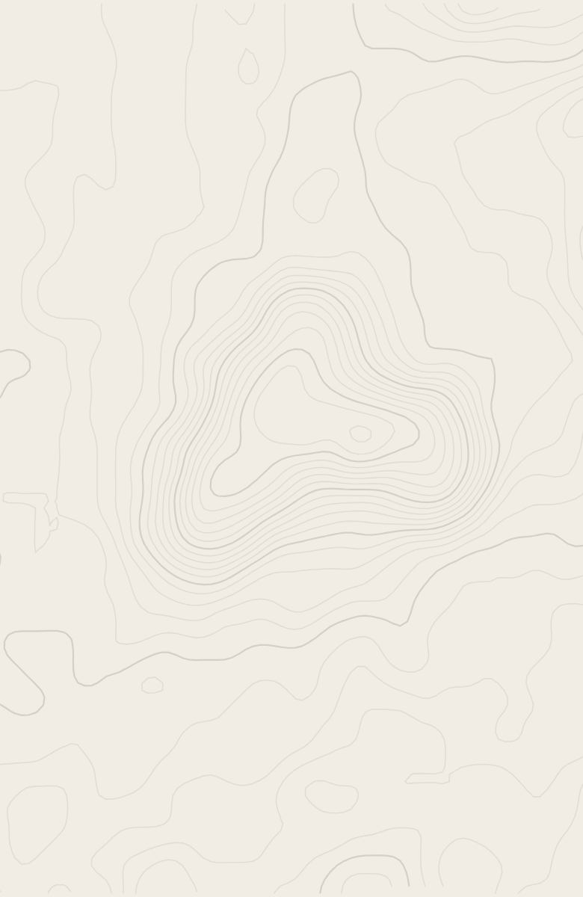
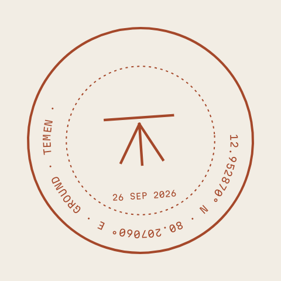

# Temen

**What the ground remembers.** Before you buy or rent anywhere on Earth, Temen shows what that ground remembers: 40 years of surface water, how low it sits, the worst rain, the earthquakes, the soil, and what to ask before you sign.

Share a location pin from WhatsApp or Google Maps (or stand on the plot and tap *Core this ground*). Ten seconds later you get a **core**: a column of strata read from now back to 1984, each with its source, years, resolution and a confidence mark, ending in *What this can't see*.

<p>



</p>

*Renders of the app's own Skia drawing code on real data: the Rising over Palm Jumeirah (JRC water mask), Live Contours around Jaisalmer Fort (AWS terrain), the Survey Seal.*

## Why

People buy flats on filled lakes. In August 2024 Hyderabad demolished a convention centre built inside a lake's buffer zone; in September 2022 upscale Bengaluru villas flooded and residents left by tractor. In the UK an environmental search is a standard part of buying a home. Most of the world has nothing like it, and in India a plot often arrives as a WhatsApp pin from a broker.

## What it reads

| Stratum | Source | Years | Resolution | Licence |
|---|---|---|---|---|
| 01 Water — now, seasonal, gone | JRC Global Surface Water (transitions) | 1984–2024 | 30 m | Copernicus / EC JRC, free with attribution |
| Buffer flag — distance to water seen since 1984 | JRC Global Surface Water | 1984–2024 | 30 m | as above |
| 02 Ground — does it sit in a bowl? | AWS Terrain Tiles (terrarium) | SRTM 2000 + others | ~10–30 m | open data with attribution |
| 03 Rain — wettest day, heavy days a year | NASA POWER daily PRECTOTCORR | 1981–2025 | 0.5° × 0.625° | NASA open data |
| 04 Quakes — M4.5+ within 300 km | USGS earthquake catalogue | 1900–today | catalogue | US public domain |
| 05 Soil — clay, sand, silt | ISRIC SoilGrids v2.0 | modelled 2020 | 250 m | CC BY 4.0 |
| Monsoon Watch — next 24 h | MET Norway Locationforecast 2.0 | forecast | model grid | CC BY 4.0 |
| Relief mode — active floods | GDACS | last 14 days | event point | free with attribution |
| Time machine | Google Earth Timelapse | 1984–2022 | 30 m | CC BY 4.0 |
| Map | OpenFreeMap (OpenMapTiles, OpenStreetMap) | — | — | ODbL / attribution |

No API keys, no accounts, no AI models.

**Rules the app never breaks:** it never calls a place safe or unsafe, never claims official full-tank lines or legal boundaries, and never predicts floods. Every core ends with what it cannot see: lakes filled before 1984, drains narrower than a pixel, official boundaries, and single plots (a pixel is about 30 m, so it reads the street, not the house).

## Accuracy

Offline golden tests run against recorded tiles on every `npm test`. This table is generated from the same fixtures with `npm run accuracy`:

| Site | Why it is here | Water memory (9×9 JRC px) | Ground (400 m ring) | Expected | Result |
|---|---|---|---|---|---|
| Palm Jumeirah, Dubai (25.1173, 55.1351) | Land reclaimed from the sea from 2001. | 89% lost water (now 0%, gone 89%) | no height data (new land) | water: lost | ✅ pass |
| Chennai One SEZ, Thoraipakkam (12.9442, 80.2292) | Offices near the Pallikaranai marsh. | 67% lost water (now 0%, gone 67%) | 0.0 m vs 0.9 m; lower than 10/16 | water: lost | ✅ pass |
| Kuberan Nagar, Madipakkam, Chennai (12.95287, 80.20706) | Residential colony in low-lying south Chennai. | 52% lost water (now 0%, gone 52%) | −1.5 m vs 1.5 m; lower than 16/16 → bowl | water: lost, bowl: yes | ✅ pass |
| Jaisalmer Fort (dry control) (26.9124, 70.9126) | Hilltop fort in the Thar desert. | 0% — no water 1984–2024 | 276.1 m vs 237.2 m; lower than 0/16 | water: none, buffer: no | ✅ pass |
| Hussain Sagar, Hyderabad (on-water control) (17.4239, 78.4738) | Centre of a 16th-century lake. | 100% water now (now 100%, gone 0%) | 512.0 m vs 512.0 m; lower than 9/16 | water: onWater | ✅ pass |

Rain, quakes and soil parse recorded API responses once `npm run fixtures` has saved them (the Chennai check expects Cyclone Michaung: ≥ 150 mm on 4 Dec 2023).

## Money (RevenueCat)

- **Free:** unlimited quick checks — the headline, the water and ground strata, the Rising and the time machine. Those sell the app.
- **This place** (`report_single`, consumable): the full core, every question and the PDF for one place. The unlock belongs to the place (an ~11 m grid), so re-coring the same plot keeps it.
- **Pro** (`pro_monthly`, `pro_annual`, entitlement `pro`): every place, compare, Monsoon Watch, offline cores.
- **Contextual paywall:** leads with this plot's own finding ("52% of the ground around this pin was water after 1984, and isn't now") next to its core with the paid strata greyed. Custom screen built from `getOfferings()`; impressions are reported with `trackCustomPaywallImpression`. The stock RevenueCat paywall is only a fallback.
- **Relief mode:** inside an active flood reported by GDACS, full reports are free. Pro subscribers pay for that.
- **Restore:** single reports restored on a new phone come back as report credits you can apply to any place. Customer Center handles subscriptions.
- Builds: RevenueCat **Test Store** for development and the demo; **Galaxy Store** (`react-native-purchases-store-galaxy`) for the release build.

## Run it

```bash
npm install
cp .env.example .env          # EXPO_PUBLIC_RC_TEST_KEY = your RevenueCat Test Store public key
npx expo run:android          # builds the dev client and installs it on the connected phone
npm start                     # later: JS changes reload without a rebuild

npm test                      # ground-memory golden tests (offline) + app unit tests
npx tsc --noEmit
npm run fixtures              # once, with network: records tiles and API responses for the tests
npm run accuracy              # prints the table above
```

Env var names only live here; values go in `.env` (gitignored) and EAS env: `EXPO_PUBLIC_RC_STORE` (`test` | `galaxy`), `EXPO_PUBLIC_RC_TEST_KEY`, `EXPO_PUBLIC_RC_GALAXY_KEY`, `EXPO_PUBLIC_APP_UA`.

## How it is built

- Expo SDK 57 (React Native 0.86, New Architecture), expo-router, TypeScript.
- **[`ground-memory/`](ground-memory)** — the analysis as a small TypeScript library with no React Native imports: tile maths, PNG decoding, the JRC palette, bowl check, rain/quake/soil parsers, the verdict and the question rules. It runs in Node, in tests and in the app.
- MapLibre React Native v11 + OpenFreeMap for maps; React Native Skia + Reanimated 4 for the set-pieces:
  - **The Rising** — an SkSL shader over the JRC mask: every 30 m pixel the satellites saw as water fills with lake-blue caustics as a water table sweeps up; water that is gone carries dotted lake-memory; *NOW* drains it back to today.
  - **The Core Pull** — the pin extrudes into a shaded core that lifts off the map as the strata settle.
  - **Live Contours** — the place's own contour lines (d3-contour on the terrain tile) behind the result, drifting with device tilt.
  - **The Year Dial** — 1:1 drag, momentum projection, velocity hand-off, rubber-band ends, a haptic tick per year; drives the Timelapse player when it allows.
  - **The Survey Seal** — a surveyor's benchmark mark with the coordinates to six decimals, stamped on save and printed on the PDF.
- Reduced motion swaps every set-piece for a crossfade. Hindi and English, spoken verdicts (expo-speech), cores saved offline in SQLite kv-store.

## Layout

```
src/app/            screens (expo-router)
src/setpieces/      Skia drawings, each a pure drawing plus a thin on-device wrapper
src/components/     UI primitives in the "Core Sample" design language
src/services/       network, storage, purchases, report, watch
src/state/          small persisted stores
ground-memory/      the open-source analysis library, tests and fixtures
```

## Credits

Fonts: Instrument Serif, Hanken Grotesk and Martian Mono (SIL Open Font License). Data as listed above; map © OpenStreetMap contributors via OpenFreeMap.

## License

MIT — see [LICENSE](LICENSE).
