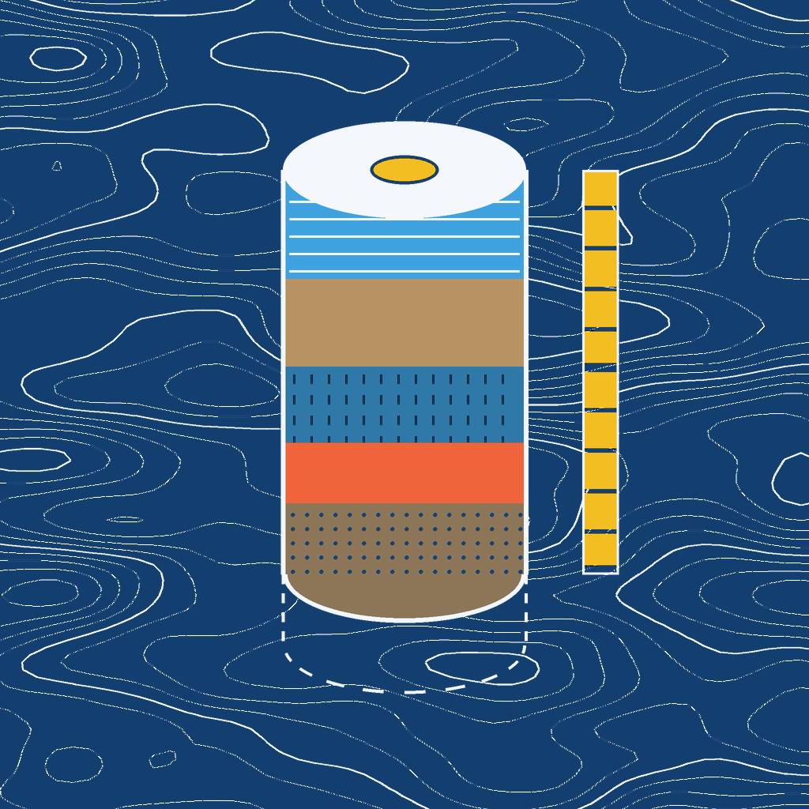
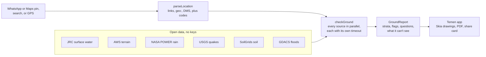

<p align="center">
  
</p>

<h1 align="center">Temen</h1>

<p align="center"><b>What the ground remembers.</b><br/>
Before you buy or rent anywhere on Earth, see what that ground has been through: 40 years of surface water, how low it sits, the worst rain on record, earthquakes, the soil, and the questions to ask before you sign.</p>

<p align="center">
  <a href="#accuracy"></a>
  
  
  
  
  <a href="LICENSE"></a>
</p>

---

Share a location pin from WhatsApp or Google Maps, or stand on the plot and tap *Core this ground*. About ten seconds later you get a **core**: a column of strata read from today back to 1984. Each one names its source, years and resolution and carries a confidence mark. The last one is always *What this can't see*.

<p align="center">
  
  
  
</p>
<p align="center"><sub>Drawn by the app's own Skia code from real data: the Rising over Palm Jumeirah (JRC water mask), Live Contours around Jaisalmer Fort (AWS terrain) and the Survey Seal.</sub></p>

## Why

People buy flats on filled lakes. In August 2024 Hyderabad demolished a convention centre built inside a lake's buffer zone. In September 2022 upscale Bengaluru villas flooded and residents left by tractor. In the UK an environmental search is a normal part of buying a home; most of the world has nothing like it, and in India a plot often arrives as a WhatsApp pin from a broker.

Satellites have been photographing that ground since 1984. Temen reads what they recorded at one point and says it in plain words. *Temen* is Sumerian for "foundation".

## What a core reads

| Stratum | Source | Years | Resolution | Licence |
|---|---|---|---|---|
| 01 Water: now, seasonal, gone | JRC Global Surface Water (transitions) | 1984–2024 | 30 m | Copernicus / EC JRC, free with attribution |
| Buffer flag: distance to water seen since 1984 | JRC Global Surface Water | 1984–2024 | 30 m | as above |
| 02 Ground: does it sit in a bowl? | AWS Terrain Tiles (terrarium) | SRTM 2000 + others | ~10–30 m | open data with attribution |
| 03 Rain: wettest day, heavy days a year | NASA POWER daily PRECTOTCORR | 1981–2025 | 0.5° × 0.625° | NASA open data |
| 04 Quakes: M4.5+ within 300 km | USGS earthquake catalogue | 1900–today | catalogue | US public domain |
| 05 Soil: clay, sand, silt | ISRIC SoilGrids v2.0 | modelled 2020 | 250 m | CC BY 4.0 |
| Monsoon Watch: next 24 h | MET Norway Locationforecast 2.0 | forecast | model grid | CC BY 4.0 |
| Relief mode: active floods | GDACS | last 14 days | event point | free with attribution |
| Time machine | Google Earth Timelapse | 1984–2022 | 30 m | CC BY 4.0 |
| Map | OpenFreeMap (OpenMapTiles, OpenStreetMap) | — | — | ODbL / attribution |

SoilGrids models no soil under buildings, so for a built-over pin Temen borrows the nearest modelled soil within 10 km and says where it came from.

None of the data needs an API key, and there is no AI model anywhere in the pipeline. Every reading is plain arithmetic on public records, and the tests pin it to real places.

**What Temen never does.** It never calls a place safe or unsafe, never claims official full-tank lines or legal boundaries, and never predicts floods. Every core ends with what it can't see: lakes filled before 1984, drains narrower than a pixel, official boundaries, and single plots. A pixel is about 30 m, so it reads the street, not the house.

## Accuracy

Golden tests run offline against recorded tiles and API responses on every `npm test`. This table is printed from the same fixtures by `npm run accuracy`:

| Site | Why it is here | Water memory (9×9 JRC px) | Ground (400 m ring) | Expected | Result |
|---|---|---|---|---|---|
| Palm Jumeirah, Dubai (25.1173, 55.1351) | Land reclaimed from the sea from 2001. | 89% lost water (now 0%, gone 89%) | no height data (0 m sea fill) | water: lost | ✅ pass |
| Chennai One SEZ, Thoraipakkam (12.9442, 80.2292) | Offices near the Pallikaranai marsh. | 67% lost water (now 0%, gone 67%) | no height data (0 m sea fill) | water: lost | ✅ pass |
| Kuberan Nagar, Madipakkam, Chennai (12.95287, 80.20706) | Residential colony in low-lying south Chennai. | 52% lost water (now 0%, gone 52%) | −1.5 m vs 1.5 m; lower than 16/16 → bowl | water: lost, bowl: yes | ✅ pass |
| Jaisalmer Fort (dry control) (26.9124, 70.9126) | Hilltop fort in the Thar desert. | 0% — no water 1984–2024 | 276.1 m vs 237.2 m; lower than 0/16 | water: none, buffer: no | ✅ pass |
| Hussain Sagar, Hyderabad (on-water control) (17.4239, 78.4738) | Centre of a 16th-century lake. | 100% water now (now 100%, gone 0%) | 512.0 m vs 512.0 m; lower than 9/16 | water: onWater | ✅ pass |

The recorded rain, quake and soil responses are checked against events that were looked up by hand. For example, the wettest day in the Chennai record has to be Cyclone Michaung on 4 Dec 2023, with Cyclone Nisha (27 Nov 2008) among the top days.

## The app

- **First run.** Temen never cores on its own. The last introduction page asks where to start (where you stand, a pin or a search), and location is asked for only if you pick where you stand.
- **Home.** Search a place, paste a Maps link or plus code, *Core this ground* with GPS, or *Drop a pin*. Shortcuts underneath open a pasted link, the time machine, Compare, Watch and Places. Your locality is set large with the town small beneath it, and the latest core and saved places sit below.
- **The check.** The Rising, the Core Pull, then the core. Card, text, copy, maps, directions, re-core, compare and delete sit right under the headline, with sources and method behind ⋯. A speaker reads the result aloud and stops when tapped again.
- **Places.** Every core on the phone: All, Saved or Flagged, sorted newest, oldest, by name, by flags or by distance, with a filter. Select mode compares two to five places or deletes any number, and unsaved checks older than 30 days can be cleared in one go.
- **Compare.** Two to five cores side by side with their strata lined up and the most notable reading in each row marked.
- **Watch.** Monsoon Watch (Pro): the next 24 hours of rain at every saved place, with a local alert past the IMD "heavy" line (64.5 mm). Each place can be muted, shared or dropped.
- **Share card.** Any core as a 1080 × 1350 image: the place, its core beside one row per stratum, the coordinates, the sources and "not a safety rating". Sealed strata stay sealed on the card.
- **PDF report and site kit.** The full core, the questions and the sources with a Survey Seal, plus a checklist for the site visit and geo-stamped photos.
- **Time machine.** Google Earth Timelapse with the Year Dial. The dial seeks the player, and the player's playback moves the dial.
- **Account.** Optional sign-in (Google or a one-time email code) that backs up your places and carries Pro to a new phone. The account and everything synced to it can be deleted from inside the app.
- **Light and language.** The paper follows the sun where you are (dawn, day, dusk, night), or pick Light, Dark or System. Reduce motion is a preference. Hindi and English throughout, including the spoken reading.

## Money (RevenueCat)

- **Free:** unlimited quick checks, which means the headline, the water and ground strata, the Rising and the time machine.
- **This place** (`report_single`, consumable): the full core, every question and the PDF for one place. The unlock belongs to the place (an ~11 m grid), so re-coring the same plot keeps it.
- **Pro** (`pro_monthly`, `pro_annual`, entitlement `pro`): every place, compare, Monsoon Watch and offline cores.
- **Contextual paywall:** it opens with this plot's own finding ("52% of the ground around this pin was water after 1984, and isn't now") next to its core, with the paid strata greyed out. It's a custom screen built from `getOfferings()`, and impressions are reported with `trackCustomPaywallImpression`. The stock RevenueCat paywall is only a fallback.
- **Relief mode:** inside an active flood reported by GDACS, full reports are free. Pro subscriptions pay for that.
- **Restore:** single reports restored on a new phone come back as credits you can spend on any place. Customer Center handles subscriptions.
- **Stores:** RevenueCat Test Store for development and the demo build; Galaxy Store (`react-native-purchases-store-galaxy`) for the release build.

## How it works



- **[`ground-memory/`](ground-memory)** does the analysis. It's a small TypeScript library with no React Native imports: tile maths, PNG decoding, the JRC palette, the bowl check, the rain, quake and soil parsers, the verdict and the question rules. It runs the same in Node, in the tests and in the app. A source that fails or times out becomes an error stratum instead of holding up the rest. Soil (SoilGrids, often the slowest) gets a short grace after the others; if it is still out, the core opens with soil marked "still reading" and fills it in when it lands (`onLate`).
- **The app** is Expo SDK 57 (React Native 0.86, New Architecture) with expo-router and TypeScript. Maps are MapLibre React Native v11 on OpenFreeMap, place names come from Photon, and cores are kept offline in SQLite kv-store. Accounts are Supabase, and purchases are RevenueCat.
- **The drawings** are React Native Skia and Reanimated 4:
  - **The Rising:** an SkSL shader over the JRC mask. Every 30 m pixel the satellites saw as water fills with caustics as a water table sweeps up; water that is gone keeps a dotted lake-memory, and *NOW* drains it back to today.
  - **The Core Pull:** the pin extrudes into a shaded core that lifts off the map as the strata settle.
  - **Live Contours:** the place's own contour lines (d3-contour on the terrain tile) behind the result, drifting with device tilt.
  - **The Year Dial:** 1:1 drag, momentum, velocity hand-off, rubber-band ends and a haptic tick per year.
  - **Terrain:** every screen stands on its own seeded piece of imaginary ground, drawn once. The check screen swaps it for the place's real contours.
  - **The Survey Seal:** a surveyor's benchmark mark with the coordinates to six decimals, stamped on save and printed on the PDF.
- **Reduced motion** turns every animation into a crossfade.
- **The spoken reading** uses expo-speech, with ranges, dates and units written out so the voice says "1984 to 2024", not "1984 minus 2024".

### Using ground-memory on its own

```ts
import { checkGround } from 'ground-memory';

const report = await checkGround({ lat: 12.95287, lon: 80.20706 }, { fetchJson, fetchTile, now: () => new Date(), userAgent: 'your-app/1.0' });

report.headline;   // "Water was here, and the ground still dips"
report.strata;     // readings, each with its source, years and resolution
report.questions;  // what to ask before you sign
report.cantSee;    // what this can't tell you
```

You pass in the network (`fetchJson`, `fetchTile`) and the clock, so the same code runs offline in tests. The [library README](ground-memory/README.md) has the full example, the module list and the JRC palette.

## Run it

You need Node, JDK 17, the Android SDK, and an Android phone (USB debugging on) or an emulator.

```bash
npm install
cp .env.example .env     # add your RevenueCat Test Store public key (EXPO_PUBLIC_RC_TEST_KEY)
npx expo run:android     # builds the dev client and installs it on the connected phone
npm start                # after that, JS changes reload without a rebuild

npm test                 # golden tests (offline), unit tests, and a render test of every main screen
npm run typecheck
npm run fixtures         # with network: re-record the tiles and API responses the tests use
npm run accuracy         # print the accuracy table above
```

The environment variables are listed in [`.env.example`](.env.example). They all ship inside the app, so none of them is a secret. A dev build only needs the RevenueCat Test Store key. Without the Supabase pair the app builds without accounts and everything else still works.

For an installable APK, run `eas build -p android --profile preview`, or build locally with `npx expo run:android --variant release` (it reads `.env`, and the APK lands in `android/app/build/outputs/apk/release/`).

**Accounts backend.** [`supabase/`](supabase) has the `profiles` and `cores` tables with row-level security (each row is readable only by its owner), a sign-up trigger, and the `delete-account` Edge Function, which deletes the caller's own account from their access token. The privacy policy and terms are in [PRIVACY.md](PRIVACY.md) and [TERMS.md](TERMS.md), the same text the app shows.

## Layout

```
src/app/          screens (expo-router)
src/components/   UI pieces: Terrain, Staff, Stratum, instrument keys, sheets
src/setpieces/    Skia drawings, each a pure drawing plus a thin on-device wrapper
src/features/     check, places, compare, watch, share card, report, site kit, time machine
src/services/     network, storage, purchases, accounts and sync, report, watch
src/state/        small persisted stores and the rules behind them
src/theme/        palettes for dawn, day, dusk and night; type, motion, reduced motion
src/i18n/         English and Hindi strings
src/test/         render tests for every main screen and the share card
ground-memory/    the open-source analysis library, its tests and recorded fixtures
supabase/         accounts schema and the delete-account function
```

## Credits

Data from the providers in the table above. Map © OpenStreetMap contributors via OpenFreeMap; place names from Photon by komoot. Fonts: Big Shoulders Stencil, Geologica and Martian Mono (SIL Open Font License).

## Licence

MIT. See [LICENSE](LICENSE).
